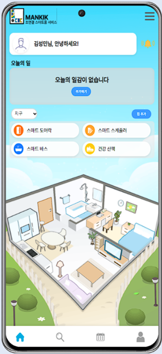
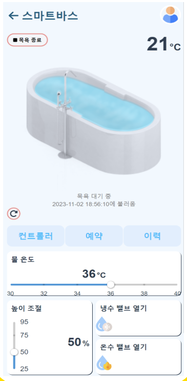
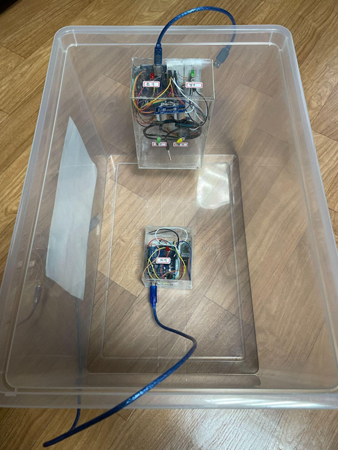
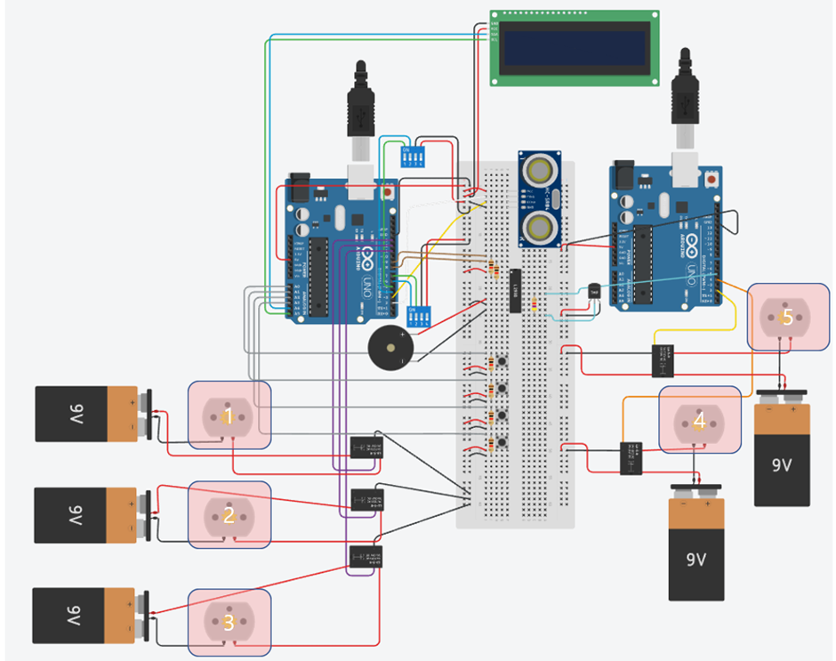

# mankik_bath

## 💡 개요

스마트홈 욕실 예약 및 자동 실행 서비스

| 관련 자료
[설계](https://docs.google.com/presentation/d/11UVl9hjiWx67RCeaFT6Fi5v-RCZOCxbQ4tGU-DNVrZQ/edit#slide=id.g21424a62289_9_0) /
[발표](https://www.miricanvas.com/v/14ac2z9)

 

## ⚙️ 프로젝트 기간

2023.06 - 2023.9

## ⚙️ 주요 기능

1. 목욕 원격 실행
2. 목욕 예약
3. 목욕 히스토리
4. 세부 기능 실행

## 📖 사진

<h3>1️⃣메인 앱</h3>

<h3>2️⃣만끽 바스 메인 화면</h3>

<h3>3️⃣만끽 바스 기기</h3>

<h3>4️⃣시스템 아키텍처</h3>

<h3>5️⃣회로도</h3>

## 👨‍👦 참가자

<table>
 <tr>
    <td align="center"></td>
    <td align="center"></td>
    <td align="center"></td>
    <td align="center"></td>
  </tr>
  <tr>
    <td align="center"><a href="https://github.com/kOsari5948"><b>김민철</b></a></td>
    <td align="center"><a href="https://github.com/leafeafeaf"><b>김성민</b></a></td>
    <td align="center"><a href="https://github.com/xlloew"><b>이정찬</b></a></td>
    <td align="center"><a href="https://github.com/dispear"><b>박지훈</b></a></td>
  </tr>
</table>

| 김민철           | 김성민 | 이정찬 | 박지훈 |
| ---------------- | ------ | ------ | ------ |
| 팀장, BE, 인프라 | FE     | EMB    | EMB    |

## 🛠️ 기술 스택

